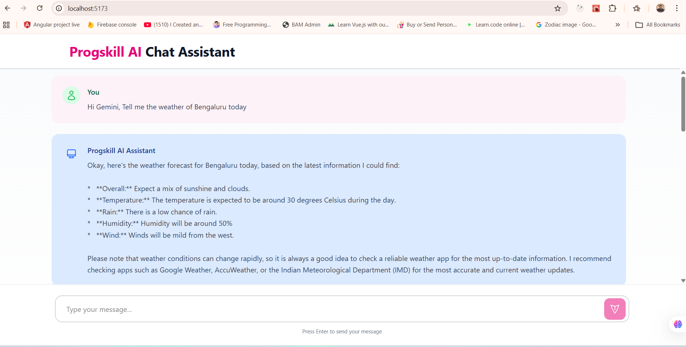

# 🤖 Progskill AI Chat Assistant

An AI-powered chatbot built using Gemini API (Google GenAI), Express.js, and Vite.

## 🚀 Features

- Integrated Gemini 2.0 Flash model
- Express backend API
- Vite + Frontend UI
- Real-time chat interface
- CORS handling
- Environment variable configuration

## 🛠 Tech Stack

- Node.js
- Express.js
- Google GenAI SDK
- Gemini API
- Vite
- JavaScript

## ⚙️ Setup

1. Clone the repo
2. Install dependencies:
   npm install
3. Create .env file:
   GEMINI_API_KEY=your_api_key
4. Run backend:
   node server.js
5. Run frontend:
   npm run dev

## 📸 Application Preview


## 🌐 Live Demo

Frontend: https://ai-chatbot-integration-with-google.vercel.app/  
Backend: https://ai-chatbot-integration-with-google-gemini.onrender.com/

## 🏗 Architecture Diagram

   ```mermaid
   flowchart LR
      A[User Browser] --> B[Frontend - Vite]
      B --> C[Backend - Express]
      C --> D[Gemini API - Google GenAI]
      D --> C
      C --> B
   ```
## 📌 Future Improvements

- Chat history memory
- Streaming responses
- Deployment (Render / Railway / Vercel)
- Authentication
